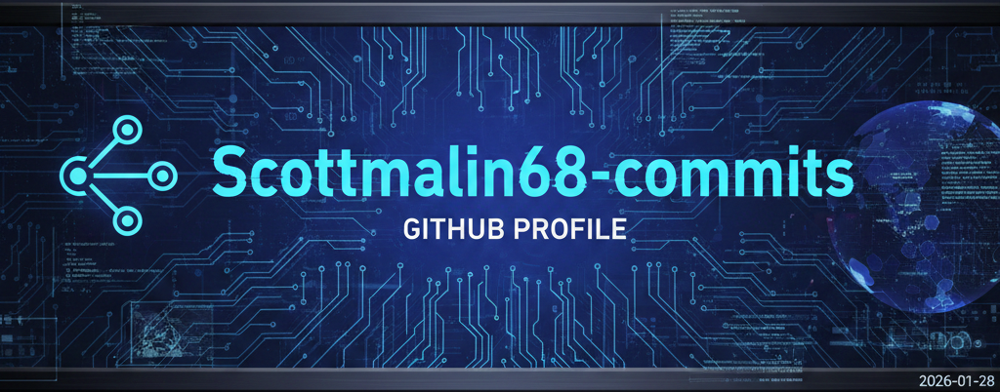

  

<h1 align="center">Scott Malin</h1>
<h3 align="center">Cybersecurity & Automation Architect • 22+ Years in Enterprise Security Engineering</h3>

Designing deterministic, audit‑ready systems that blend cybersecurity, automation, documentation governance, and operational clarity.

  
  
  
  

---

<table>
<tr>
<td width="58%" valign="top">

<h2>🧭 Ecosystem Map</h2>

A unified view of my cybersecurity, cloud, automation, and professional‑development tooling.  
Each repository plays a specific role in a larger architecture designed around governance, reasoning quality, and deterministic automation.

<h3>🔐 Cybersecurity Engineering</h3>

<strong>Repos:</strong> 
<a href="https://github.com/scottmalin68-commits/Cybersecurity-Prompts">Cybersecurity‑Prompts</a> 
<a href="https://github.com/scottmalin68-commits/Cybersecurity-Learning-Prompts">Cybersecurity‑Learning‑Prompts</a> 
<a href="https://github.com/scottmalin68-commits/Powershell_Scripts">Powershell_Scripts</a>

<strong>Featured Assets:</strong> 
Threat Intelligence Aggregator 
Hardening Recommendation Engine 
Cascading Failure Simulator

<h3>☁️ Cloud & IAM Architecture</h3>

<strong>Repo:</strong> 
<a href="https://github.com/scottmalin68-commits/Azure-Related-Prompts">Azure‑Related‑Prompts</a>

<strong>Featured Assets:</strong> 
Conditional Access Documentation Generator 
Zero Trust Gap Analyzer 
CA Policy Conflict Detector

<h3>⚙️ Automation & Reasoning Frameworks</h3>

<strong>Repos:</strong> 
<a href="https://github.com/scottmalin68-commits/Misc-AI-Prompts">Misc‑AI‑Prompts</a> 
<a href="https://github.com/scottmalin68-commits/Learning-Games-Prompts">Learning‑Games‑Prompts</a>

<strong>Featured Assets:</strong> 
Explain Like I’m Wrong (ELIW) 
Reasoning Validator 
DBAR Design Companion

<h3>🎯 Career & Professional Development</h3>

<strong>Repo:</strong> 
<a href="https://github.com/scottmalin68-commits/Job-Search-Career-Prompts">Job‑Search‑Career‑Prompts</a>

<strong>Featured Assets:</strong> 
Resume Optimizer 
Interview Scenario Generator 
STAR Story Builder

<h3>🧠 Automation Philosophy</h3>

I design deterministic, audit‑ready automation that reduces cognitive load, enforces documentation standards, and accelerates decision‑making across cybersecurity and cloud environments.  
My repositories form a unified ecosystem of reusable reasoning frameworks, governance tools, and workflow accelerators — built for engineers, architects, and auditors who demand clarity and consistency.

</td>

<td width="42%" valign="top" align="center">

</td>
</tr>
</table>

---

# 🏗️ What I’m Building Right Now

### 🔹 A Unified Documentation Enforcement Ecosystem  
A cross‑repo governance framework that enforces:
- README standards  
- Changelog requirements  
- Prompt goal statements  
- Risk scoring  
- CI‑based documentation checks  

### 🔹 A Suite of Reusable GitHub Actions  
Including:
- Script documentation reviewers  
- Weighted scoring engines  
- Governance signals  
- Repo branding automation  

### 🔹 A Fully Branded GitHub Portfolio  
Every repo now includes:
- Cyber Blue banner  
- Unified README structure  
- Badge suite  
- Featured sections  
- Cross‑repo navigation  
- Consistent tone and presentation  

---

# 🧩 Featured Repositories

### 🛡️ Cybersecurity Prompt Library  
High‑impact AI prompts for security, leadership, and user protection.  
**Repo:** https://github.com/scottmalin68-commits/Cybersecurity-Prompts

### 🧰 PowerShell Security & Automation Toolkit  
Production‑ready PowerShell tools for AD, endpoints, and governance.  
**Repo:** https://github.com/scottmalin68-commits/Powershell_Scripts

### 🧩 Misc AI Prompt Library  
Frameworks for productivity, communication, and structured thinking.  
**Repo:** https://github.com/scottmalin68-commits/Misc-AI-Prompts

### 🎮 Learning Games Prompt Library  
Gamified learning experiences powered by AI.  
**Repo:** https://github.com/scottmalin68-commits/Learning-Games-Prompts

---

# Prompts Shared on LinkedIn  
*(Last updated: January 2026)*

These AI prompts from the Cybersecurity-Prompts repo (and one topical one) have been shared and discussed on my LinkedIn profile:

- Conditional Access Policy Analyzer  
- Scam Detection Conversation Helper  
- Incident Command: IR Simulator  
- Advanced Teams Meeting Analyst (Copilot Enhancement)  
- Plain-English Security Concept Explainer  
- Daily Cyber Threat Brief  
- Social Engineering Awareness Quiz  
- Advanced Cybersecurity Threat Intelligence Aggregator  
- Vendor Claim Evaluator – Security Edition  
- Generic Driveway Snow Clearing Advisor (topical for recent storms)  

Check the repo for the latest versions.

---

# 🧠 Core Skills & Strengths

### 🔐 Cybersecurity Engineering  
- Endpoint defense architecture  
- Privilege drift detection  
- AD security posture analysis  
- Threat modeling & risk scoring  

### ⚙️ Automation & Tooling  
- PowerShell engineering  
- CI/CD governance  
- GitHub Actions development  
- Deterministic workflow design  

### 📝 Documentation & Governance  
- README standards  
- Changelog enforcement  
- Repo branding  
- Executive‑ready communication  

### 🤖 AI‑Driven Frameworks  
- Prompt engineering  
- AI‑assisted documentation  
- Conversational safety frameworks  
- Learning games & guided experiences  

---

# 📈 Current Goals

- Apply **Cyber Blue branding** across all repos  
- Publish **reusable GitHub Actions** to the Marketplace  
- Expand prompt libraries with goal‑driven structure  
- Build a **cross‑repo dashboard** for visibility and navigation  
- Continue refining deterministic governance workflows  

---

# 📫 Connect

If you’re interested in cybersecurity automation, documentation governance, or building deterministic systems, feel free to explore my repos or reach out.
