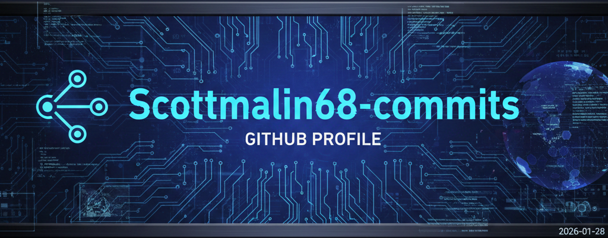

  

<h1 align="center">Scott Malin</h1>
<h3 align="center">Senior Cybersecurity Engineer • Endpoint • Zero Trust • Automation</h3>
<h4 align="center">CISSP • CEH • 30 Years Enterprise Experience</h4>

Designing deterministic, audit-ready systems that blend cybersecurity engineering, automation, documentation governance, and operational clarity.

  
  
  
  

### 📣 A Note on This Work

All content across these repositories — prompt frameworks, PowerShell tools, governance actions, career intelligence systems, and branded documentation patterns — is 100% original work.

This ecosystem was built with the same discipline I applied for two decades as a security engineer: measurable outcomes, clean audit trails, and zero tolerance for fabrication. The volume and cross-linking are intentional. Every asset is designed to be reusable, versioned, and production-grade.

---

<table>
<tr>
<td width="58%" valign="top">

<h2>🧭 Ecosystem Map</h2>

A unified view of cybersecurity, automation, cloud/IAM, and career-intelligence tooling.  
Each repository serves a specific role in a larger architecture built around governance, reasoning quality, and deterministic automation.

<h3>🔐 Cybersecurity Engineering</h3>

<strong>Repos:</strong> 
<a href="https://github.com/scottmalin68-commits/Cybersecurity-Prompts">Cybersecurity-Prompts</a>  
 

<a href="https://github.com/scottmalin68-commits/Cybersecurity-Learning-Prompts">Cybersecurity-Learning-Prompts</a>  
 

<a href="https://github.com/scottmalin68-commits/Powershell_Scripts">Powershell_Scripts</a>  

<strong>Featured Assets:</strong> 
Daily Cyber Threat Brief (Easy Mode) 
Threat Intelligence Aggregator 
Hardening Recommendation Engine 
AD Privilege Analyzer

<h3>☁️ Cloud & IAM Architecture</h3>

<strong>Repo:</strong> 
<a href="https://github.com/scottmalin68-commits/Azure-Related-Prompts">Azure-Related-Prompts</a>  

<strong>Featured Assets:</strong> 
Conditional Access Documentation Generator 
Zero Trust Gap Analyzer 
CA Policy Conflict Detector

<h3>⚙️ Automation & Reasoning Frameworks</h3>

<strong>Repos:</strong> 
<a href="https://github.com/scottmalin68-commits/Misc-AI-Prompts">Misc-AI-Prompts</a>  
 

<a href="https://github.com/scottmalin68-commits/Learning-Games-prompts">Learning-Games-prompts</a>  
 

<a href="https://github.com/scottmalin68-commits/repo-integrity-manifest-action">repo-integrity-manifest-action</a>  

<strong>Featured Assets:</strong> 
Explain Like I’m Wrong (ELIW) 
Reasoning Validator 
Repo Integrity Manifest Action

<h3>🎯 Career & Professional Development</h3>

<strong>Repos:</strong> 
<a href="https://github.com/scottmalin68-commits/Job-Search-Career-Prompts">Job-Search-Career-Prompts</a>  
 

<a href="https://github.com/scottmalin68-commits/Personal-Career-Operating-System">Personal-Career-Operating-System</a>  

<strong>Featured Assets:</strong> 
Strategic Integrity Resume Engine (v9.5.0) 
Competency Signal Fit Engine 
Job Posting Intelligence / JSOM OSINT Engines 
Daily Momentum Engine 
Career Operating System (PCOS)

<h3>🧠 Automation Philosophy</h3>

I design deterministic, audit-ready automation that reduces cognitive load, enforces documentation standards, and accelerates decision-making across cybersecurity and cloud environments.  
These repositories form a unified ecosystem of reusable reasoning frameworks, governance tools, and workflow accelerators — built for engineers, architects, and auditors who demand clarity and consistency.

</td>
<td width="42%" valign="top" align="center">

</td>
</tr>
</table>

---

# 🏗️ What I’m Building Right Now

### 🔹 Career Intelligence Systems (Primary Focus)
Production-grade AI frameworks that treat career materials with the same rigor as security systems:
- **Strategic Integrity** lineage (resume / cover letter / ATS optimization)
- Competency Signal Fit Engine and gap analysis
- Job Posting Intelligence + Unified OSINT Investigation (JSOM)
- Daily Momentum + Rejection Intelligence engines
- Interview prep renderers and pressure simulators

### 🔹 Threat Awareness & Public Education
Ongoing **Daily Cyber Threat Brief – Easy Mode** focused on AI voice cloning, deepfakes, social-engineering variants, and practical family protection guidance.

### 🔹 Deterministic Governance
Cross-repo standards for READMEs, changelogs, goal statements, and integrity checks — including reusable GitHub Actions.

---

# 🧩 Featured Repositories

### 🛡️ Cybersecurity Prompt Library
High-impact AI prompts for security operations, leadership, user protection, and threat awareness (including the Daily Cyber Threat Brief series).  
**Repo:** [Cybersecurity-Prompts](https://github.com/scottmalin68-commits/Cybersecurity-Prompts)

### 🧰 PowerShell Security & Automation Toolkit
Production-ready PowerShell tools for Active Directory hardening, privilege hygiene, endpoint forensics, and repo governance.  
**Repo:** [Powershell_Scripts](https://github.com/scottmalin68-commits/Powershell_Scripts)

### 🎯 Job Search & Career Prompt Library
The most actively developed repository — integrity-first engines for resumes, cover letters, job-posting OSINT, fit analysis, interview preparation, and daily momentum.  
**Repo:** [Job-Search-Career-Prompts](https://github.com/scottmalin68-commits/Job-Search-Career-Prompts)

### 🧭 Personal Career Operating System
Multi-engine system that turns daily work into long-term, evidence-based career intelligence.  
**Repo:** [Personal-Career-Operating-System](https://github.com/scottmalin68-commits/Personal-Career-Operating-System)

### 🧩 Misc AI Prompt Library
Frameworks for productivity, structured thinking, and reasoning quality.  
**Repo:** [Misc-AI-Prompts](https://github.com/scottmalin68-commits/Misc-AI-Prompts)

---

# 📢 Recent Public Sharing

Prompts and tools from these repositories are regularly shared and discussed on LinkedIn, with particular emphasis on:

- Daily Cyber Threat Brief (AI voice cloning, deepfake, and social-engineering variants)
- Scam Detection Conversation Helper
- Job Posting Intelligence / OSINT investigation engines
- Strategic Integrity resume and cover-letter systems
- Competency Signal Fit and interview-prep renderers

Check the individual repositories for the latest versions and changelogs.

---

# 🧠 Core Skills & Strengths

### 🔐 Cybersecurity Engineering
- Endpoint defense architecture at scale (250k+ endpoints)
- Zero Trust implementation (Intune / Entra ID / Zscaler)
- Privilege management & drift detection (BeyondTrust EPM and custom tooling)
- Threat modeling, risk scoring, and NIST 800-53 audit support
- Incident response (P1 SLA performance)

### ⚙️ Automation & Tooling
- PowerShell / Python engineering for security operations
- Tanium / Splunk / CI-CD governance patterns
- Deterministic workflow design and measurable impact (e.g., significant reductions in manual effort and vulnerability exposure)
- GitHub Actions and repo-integrity tooling

### 📝 Documentation & Governance
- README and changelog standards
- Prompt goal statements and risk scoring
- Executive-ready communication
- Audit-ready documentation patterns

### 🤖 AI-Driven Frameworks
- Prompt engineering with strong anti-hallucination and integrity rules
- Career intelligence systems (resume, fit analysis, OSINT, interview prep)
- Conversational safety and scam-defense frameworks
- Learning games and guided experiences

---

# 📈 Current Goals

- Continue refining the **Job-Search-Career-Prompts** intelligence layer (Strategic Integrity, fit engines, OSINT pipelines)
- Maintain and expand the **Daily Cyber Threat Brief** series for practical public education
- Keep all repositories under consistent Cyber Blue branding and governance standards
- Publish additional reusable GitHub Actions where they add clear value
- Build a lightweight cross-repo dashboard for visibility and navigation

---

**Connect:** [LinkedIn](https://www.linkedin.com/in/scottmmalin) · [GitHub](https://github.com/scottmalin68-commits)

MIT License on all public repositories.